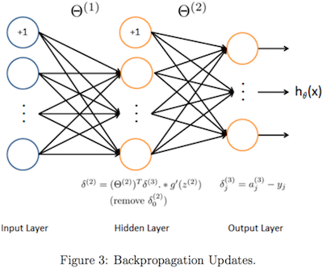

```{r setup, include=FALSE}
knitr::opts_chunk$set(echo = TRUE,  message=FALSE, warning=FALSE, 
                      fig.align = "center", fig.width = 6, fig.height = 4, 
                      rows.print = 5)
```
# Environment
```{r}
rm(list=ls())
set.seed(2017)
library(dplyr)
library(gridExtra)
library(RColorBrewer)
library(directlabels)
library(knitr)
library(R.matlab)
library(kableExtra)
library(ggplot2)
library(plotly)
f <- list(family = "Courier New, monospace", 
          size = 18, 
          color = "#7f7f7f")
```

# Function

## show dataframe inside HTML
```{r}
showDf <- function(df, title = ''){
  df %>% 
    kable(format = 'html', caption = title, digit = 6) %>%
    kable_styling(bootstrap_options = c('striped', 'hover'))
}
```

## map one or two variables to higher polynomial degree
```{r}
mapFeature <- function(X, degree = 1){
  if(class(X) != 'matrix') X <- t(t(X))
  n <- dim(X)[2]
  if(n == 1){
    for(i in 1:degree) 
      if(i == 1) mF <- X
      else mF <- cbind(mF, X ^ i)
  }else if(n == 2){
    for(i in 1:degree){
      if(i == 1) mF <- X
      else for(j in 0:i) mF <- cbind(mF, X[, 1] ^ (i - j) * X[, 2] ^ j)
    }
  }
  return(mF)
}
```

## sigmoid function
$$
g(z)=\dfrac{1}{1+e^{-z}}
$$
```{r}
sigmoid <- function(z){
  return(1 / (1 + exp(-z)))
}
```

### ggplot
```{r}
ggplot() + 
  stat_function(aes(-10:10), fun = sigmoid) +
  ggtitle('Sigmoid Function') +
  xlab('x') +
  ylab('f(x)')
```

### plotly  
```{r}
x <- seq(-10, 10, length = 100)
plot_ly(x = x, y = sigmoid(x),
        mode = 'lines', type = 'scatter') %>%
  layout(title = 'Sigmoid Function',
         xaxis = list(title = 'x', titlefont = f),
         yaxis = list(title = 'f(x)', titlefont = f))
```

## gradient of the sigmoid function
$$
g'(z)=
\dfrac{d}{dz}g(z)=
g(z)(1-g(z))
$$
```{r}
sigmoidGradient <- function(z) {
    return(sigmoid(z) * (1 - sigmoid(z)))
}
```

## normal equation
$$
\theta=
\left(X^TX+\lambda
\begin{bmatrix}
0 & 0  & \cdots & 0 \\
0 & 1  & \cdots & 0 \\
\vdots & \vdots & \ddots & \vdots \\
0 & 0 & \cdots & 1 \\
\end{bmatrix}
\right)^{-1}X^Ty
$$
```{r}
normalEquation <- function(X, y, lambda = 0){
  if(class(X) != 'matrix') X <- t(t(X))
  X <- cbind(rep(1, dim(X)[1]), X)
  regular <- lambda * diag(1, dim(X)[2])
  regular[1, 1] <- 0 
  theta <- solve(t(X) %*% X + regular) %*% t(X) %*% y
  return(theta)
}
```

## cost function
$$
\mbox{Linear Regression}\\
h_{\theta}(x^{(i)})=
(x^{(i)})^T\theta\\
J(\theta)=
\dfrac{1}{2m}\sum\limits_{i=1}^m\left(h_{\theta}(x^{(i)})-y^{(i)}\right)^2+\dfrac{\lambda}{2m}\sum\limits_{j=1}^n\theta_j^2=
\dfrac{1}{2m}(X\theta-y)^T(X\theta-y)+\dfrac{\lambda}{2m}\sum\limits_{j=1}^n\theta_j^2
\\
$$
$$
\mbox{Logistic Regression}\\
h_{\theta}(x^{(i)})
=g(\theta^Tx^{(i)})
=\dfrac{1}{1+e^{-\theta^Tx^{(i)}}}
=Pr(y=1|x^{(i)};\theta)\\
\begin{align}
J(\theta)
&=\dfrac{1}{m}\sum\limits_{i=1}^mCost(h_{\theta}(x^{(i)}),y^{(i)})+\frac{\lambda}{2m}\sum\limits_{j=1}^n\theta_j^2\\
&=\dfrac{1}{m}\left[\sum\limits_{i=1}^m-y^{(i)}\log h_{\theta}(x^{(i)})-(1-y^{(i)})\log (1-h_{\theta}(x^{(i)}))\right]+\frac{\lambda}{2m}\sum\limits_{j=1}^n\theta_j^2\\
&=\dfrac{1}{m}\left[-y^t\log h_{\theta}(X)-(1-y)^T\log (1-h_{\theta}(X))\right]+\frac{\lambda}{2m}\sum\limits_{j=1}^n\theta_j^2\\
&=\dfrac{1}{m}\left[-y^t\log g(X\theta)-(1-y)^T\log (1-g(X\theta))\right]+\frac{\lambda}{2m}\sum\limits_{j=1}^n\theta_j^2
\end{align}
$$
```{r}
costFunction <- function(X, y, lambda = 0, type = c('lin', 'log')){
  function(theta){
    if(class(X) != "matrix") X <- t(t(X))
    m <- dim(X)[1]
    X <- cbind(rep(1, m), X)
    pt <- theta
    pt[1] <- 0
    regular <- lambda / (2 * m) * t(pt) %*% pt
    if(type == 'lin') return(t(X %*% theta - y) %*% (X %*% theta - y) / (2 * m) + regular)
    else if(type == 'log'){
      h <- sigmoid(X %*% theta)
      return((-t(y) %*% log(h) - t(1 - y) %*% log(1 - h)) / m + regular)
    }
  }
}
```

## gradient operator
$$
\mbox{Linear Regression}\\
\nabla_{\theta}J=
\dfrac{\partial}{\partial\theta_j}J(\theta)=
\dfrac{1}{m}X^T(X\theta-y)+\frac{\lambda}{m}
\begin{bmatrix}
0\\
\theta_1\\
\theta_2\\
\vdots\\
\theta_n
\end{bmatrix}
$$
$$
\mbox{Logistic Regression}\\
\nabla_{\theta}J=
\dfrac{\partial}{\partial\theta_j}J(\theta)=
\begin{bmatrix}
\frac{1}{m}\sum_{i=1}^m\left(h_{\theta}(x^{(i)})-y^{(i)}\right)x_0^{(i)}+0\\
\frac{1}{m}\sum_{i=1}^m\left(h_{\theta}(x^{(i)})-y^{(i)}\right)x_1^{(i)}+\frac{\lambda}{m}\theta_1\\
\frac{1}{m}\sum_{i=1}^m\left(h_{\theta}(x^{(i)})-y^{(i)}\right)x_2^{(i)}+\frac{\lambda}{m}\theta_2\\
\vdots\\
\frac{1}{m}\sum_{i=1}^m\left(h_{\theta}(x^{(i)})-y^{(i)}\right)x_n^{(i)}+\frac{\lambda}{m}\theta_n
\end{bmatrix}=
\frac{1}{m}X^T\left(h_{\theta}(X)-y\right)+\frac{\lambda}{m}
\begin{bmatrix}
0\\
\theta_1\\
\theta_2\\
\vdots\\
\theta_n
\end{bmatrix}
$$
```{r}
gradientFunction <- function(X, y, lambda = 0, type = c('lin', 'log')){
  function(theta){
    if(class(X) != "matrix") X <- t(t(X))
    m <- dim(X)[1]
    X <- cbind(rep(1, m), X)
    regular <- lambda / m * theta
    regular[1] <- 0
    if(type == 'lin') return(t(X) %*% (X %*% theta - y) / m + regular)
    else if(type == 'log'){
      h <- sigmoid(X %*% theta)
      return(t(X) %*% (h - y) / m +  regular)
    }
  }
}
```

## hessian matrix
$$
H=
\frac{1}{m}\left[\sum\limits_{i=1}^mh_{\theta}(x^{(i)})(1-h_{\theta}(x^{(i)}))x^{(i)}\left(x^{(i)}\right)^T\right]+
\frac{\lambda}{m}
\begin{bmatrix}
0 & 0  & \cdots & 0 \\
0 & 1  & \cdots & 0 \\
\vdots & \vdots & \ddots & \vdots \\
0 & 0 & \cdots & 1 \\
\end{bmatrix}
$$
```{r}
hessian <- function(X, y, theta, lambda = 0){
  m <- dim(X)[1]; n <- length(theta)
  X <- cbind(rep(1, m), X)
  regular <- lambda / m * diag(n)
  regular[1, 1] <- 0
  h <- sigmoid(X %*% theta)
  return(t(X) %*% X * diag(h) * diag(1 - h) / m + regular)
}
```

## compute theta
$$
\mbox{Linear Regression}\\
\theta:=
\theta-\alpha\nabla_{\theta}J
$$
$$
\mbox{Logistic Regression}\\
\theta:=\theta-H^{-1}\nabla_{\theta}J
$$
```{r}
computeTheta <- function(X, y, theta, lambda = 0, alpha = 0.01, num_iters = 100, 
                         type = c('lin', 'log'), method = c('iter', 'opti')){
  if(method == 'iter'){
    theta_vals <- theta
    J_vals <- rep(0, num_iters)
    for(i in 1:num_iters){
      if(type == 'lin'){
        theta_vals <- rbind(theta_vals, t(theta))
        J_vals[i] <- costFunction(X, y, lambda, type)(theta)
        theta <- theta - alpha * gradientFunction(X, y, lambda, type)(theta)
      }else if(type == 'log'){
        theta_vals <- rbind(theta_vals, t(theta))
        J_vals[i] <- costFunction(X, y, lambda, type)(theta)
        theta <- theta - solve(hessian(X, y, theta, lambda)) %*% 
          gradientFunction(X, y, lambda, type)(theta)
      }
    }
    return(list(theta = theta, theta_vals = theta_vals, J_vals = J_vals))
  }else if(method == 'opti'){
    costFunction <- costFunction(X, y, lambda, type)
    gradFunction <- gradientFunction(X, y, lambda, type)
    theta <- optim(theta, fn = costFunction, gr = gradFunction, method = 'BFGS')$par
    return(t(t(theta)))
  }
}
```

## one vs all
```{r}
oneVsAll <- function(X, y, lambda = 0, num_iters, num_labels, method = c('matrix', 'optim')){
  n <- dim(X)[2]
  alpha <- 0
  type <- 'log'
  for (c in 1:num_labels){
    theta_ini <- rep(0, n)
    if(method == 'matrix')
      theta <- computeTheta(X, (y == c), theta_ini, alpha, lambda, num_iters, type)$theta
    else
      theta <- optim(theta_ini, X = X, y = (y == c), lambda = lambda, type = type,
                 fn = costFunction, gr = gradientFunction,
                 method = "BFGS", control = list(maxit = num_iters))$par
    if(c == 1) all_theta <- t(theta)
    else all_theta <- rbind(all_theta, t(theta))
  }
  return(all_theta)
}
```

## one vs all predict
```{r}
predictOneVsAll <- function(all_theta, X){
  ps <- sigmoid(X %*% t(all_theta))
  return(apply(sigmoid(X %*% t(all_theta)), 1, which.max))
}
```

## display image
```{r}
displayData <- function(X, example_width = round(sqrt(dim(X)[2])))  {
  if (is.vector(X))
    X <- t(X)
  m <- dim(X)[1]
  n <- dim(X)[2]
  example_height <- (n / example_width) #20
  display_rows <- floor(sqrt(m)) #10
  display_cols <- ceiling(m / display_rows) #10
  pad <- 1
  display_array <-
    -matrix(0,pad + display_rows * (example_height + pad),
            pad + display_cols * (example_width + pad))
  curr_ex <- 1
  for (j in 1:display_rows) {
    for (i in 1:display_cols) {
      if (curr_ex > m)
        break
      max_val <- max(abs(X[curr_ex,]))
      display_array[pad + (j - 1) * (example_height + pad) + (1:example_height),
                    pad + (i - 1) * (example_width + pad) + (1:example_width)] <-
        matrix(X[curr_ex,], example_height, example_width) / max_val
      curr_ex <- curr_ex + 1
    }
    if (curr_ex > m)
      break
  }
  op <- par(bg = "gray")
  display_array <- t(apply(display_array,2,rev))
  image(
    z = display_array,col = gray.colors(100), xaxt = 'n',yaxt = 'n'
  )
  grid(
    nx = display_cols,display_rows,col = 'black',lwd = 2,lty = 1
  )
  box()
  par(op)
}
```

## neural network cost function
$$
h_{\Theta}(x)\in R^K\\
(h_{\Theta}(x))_i=i^{\text{th}}\text{ output}\\
\begin{align}
J(\Theta)&=
-\dfrac{1}{m}\left[\sum\limits_{i=1}^m\sum\limits_{k=1}^Ky_k^{(i)}\log (h_{\Theta}(x^{(i)}))_k+(1-y_k^{(i)})\log (1-(h_{\Theta}(x^{(i)}))_k)\right]\\
&+\dfrac{\lambda}{2m}\sum\limits_{l=1}^{L-1}\sum\limits_{i=1}^{s_l}\sum\limits_{j=1}^{s_l+1}(\Theta_{ji}^{(l)})^2
\end{align}
$$
```{r}
nnCostFunction  <-
  function(input_layer_size, hidden_layer_size, num_labels,X, y, lambda) {
    function(nn_params) {
      m <- dim(X)[1]
      Theta1 <-
        matrix(nn_params[1:(hidden_layer_size * (input_layer_size + 1))],
               hidden_layer_size, (input_layer_size + 1))
      Theta2 <-
        matrix(nn_params[(1 + (hidden_layer_size * (input_layer_size + 1))):length(nn_params)],
               num_labels, (hidden_layer_size + 1))
      I <- diag(num_labels)
      Y <- matrix(0, m, num_labels)
      for (i in 1:m)
        Y[i,] <- I[y[i],]
      a1 <- cbind(rep(1,m),X)
      z2 <- a1 %*% t(Theta1)
      a2 <- cbind(rep(1,dim(z2)[1]), sigmoid(z2))
      z3 <- a2 %*% t(Theta2)
      a3 <- sigmoid(z3)
      h <- a3
      p <- sum(Theta1[,-1] ^ 2) + sum(Theta2[,-1] ^ 2)
      return(sum((-Y) * log(h) - (1 - Y) * log(1 - h)) / m + lambda * p / (2 * m))
    }
  }
```

## neural network gradient function

```{r}
nnGradFunction  <-
  function(input_layer_size, hidden_layer_size, num_labels,
           X, y, lambda) {
    function(nn_params) {
      m <- dim(X)[1]
      Theta1 <-
        matrix(nn_params[1:(hidden_layer_size * (input_layer_size + 1))],
               hidden_layer_size, (input_layer_size + 1))
      Theta2 <-
        matrix(nn_params[(1 + (hidden_layer_size * (input_layer_size + 1))):length(nn_params)],
               num_labels, (hidden_layer_size + 1))
      I <- diag(num_labels)
      Y <- matrix(0, m, num_labels)
      for (i in 1:m)
        Y[i,] <- I[y[i],]
      a1 <- cbind(rep(1,m),X)
      z2 <- a1 %*% t(Theta1)
      a2 <- cbind(rep(1,dim(z2)[1]), sigmoid(z2))
      z3 <- a2 %*% t(Theta2)
      a3 <- sigmoid(z3)
      h <- a3
      sigma3 <- h - Y
      sigma2 <-
        (sigma3 %*% Theta2) * sigmoidGradient(cbind(rep(1,dim(z2)[1]),z2))
      sigma2 <- sigma2[,-1]
      delta_1 <- (t(sigma2) %*% a1)
      delta_2 <- (t(sigma3) %*% a2)
      p1 <- (lambda / m) * cbind(rep(0,dim(Theta1)[1]), Theta1[,-1])
      p2 <- (lambda / m) * cbind(rep(0,dim(Theta2)[1]), Theta2[,-1])
      Theta1_grad <- delta_1 / m + p1
      Theta2_grad <- delta_2 / m + p2
      grad <-  c(c(Theta1_grad), c(Theta2_grad))
      return(grad)
    }
  }
```

## randomly initialize the weights of a layer 
```{R}
randInitializeWeights <- function(L_in, L_out) {
  epsilon_init <- 0.12
  rnd <- runif(L_out * (1 + L_in))
  rnd <- matrix(rnd,L_out,1 + L_in)
  W <- rnd * 2 * epsilon_init - epsilon_init
  W
}
```

## neural network predict
```{r}
predict <- function(Theta1, Theta2, X) {
  if (is.vector(X))
    X <- t(X)
  m <- dim(X)[1]
  num_labels <- dim(Theta2)[1]
  p <- rep(0,dim(X)[1])
  h1 <- sigmoid(cbind(rep(1,m),X) %*% t(Theta1))
  h2 <- sigmoid(cbind(rep(1,m),h1) %*% t(Theta2))
  p <- apply(h2,1,which.max)
  p
}
```

## debugInitializeWeights
```{r}
debugInitializeWeights  <- function(fan_out, fan_in) {
  W <- matrix(0,fan_out,1 + fan_in)
  W <- matrix(sin(1:length(W)), dim(W)[1],dim(W)[2]) / 10
  W
}
```

## computeNumericalGradient
```{r}
computeNumericalGradient <- function(J, theta) {
  numgrad <- rep(0,length(theta))
  perturb <- rep(0,length(theta))
  e <- 1e-4
  for (p in 1:length(theta)) {
    perturb[p] <- e
    loss1 <- J(theta - perturb)
    loss2 <- J(theta + perturb)
    numgrad[p] <- (loss2 - loss1) / (2 * e)
    perturb[p] <- 0
  }
  numgrad
}
```

## checkNNGradients
```{r}
checkNNGradients <- function (lambda = 0) {
  input_layer_size <- 3
  hidden_layer_size <- 5
  num_labels <- 3
  m <- 5
  Theta1 <- debugInitializeWeights(hidden_layer_size, input_layer_size)
  Theta2 <- debugInitializeWeights(num_labels, hidden_layer_size)
  X  <- debugInitializeWeights(m, input_layer_size - 1)
  y  <- 1 + t(1:m %% num_labels)
  nn_params <- c(Theta1,Theta2)
  costFunc <- nnCostFunction(input_layer_size, hidden_layer_size,
                             num_labels, X, y, lambda)
  cost <- costFunc(nn_params)
  grad <- nnGradFunction(input_layer_size, hidden_layer_size,
                         num_labels, X, y, lambda)(nn_params)
  numgrad <- computeNumericalGradient(costFunc, nn_params)
  print(cbind(numgrad, grad))
  cat(
    sprintf(
      'The above two columns you get should be very similar.
      (Left-Your Numerical Gradient, Right-Analytical Gradient)\n\n'
    )
    )
  diff <-
    norm(as.matrix(numgrad - grad)) / norm(as.matrix(numgrad + grad))
  cat(
    sprintf(
      'If your backpropagation implementation is correct, then
      the relative difference will be small (less than 1e-9).
      Relative Difference: %g', diff
    )
    )
}
```

## lbfgsb3 faster than optim
```{r}
lbfgsb3_ <- function (prm, fn, gr = NULL, lower = -Inf, upper = Inf, control = list(), 
          ...)
{
  tasklist <- c("NEW_X", "START", "STOP", "FG", "ABNORMAL_TERMINATION_IN_LNSRCH", 
                "CONVERGENCE", "CONVERGENCE: NORM_OF_PROJECTED_GRADIENT_<=_PGTOL", 
                "CONVERGENCE: REL_REDUCTION_OF_F_<=_FACTR*EPSMCH", "ERROR: FTOL .LT. ZERO", 
                "ERROR: GTOL .LT. ZERO", "ERROR: INITIAL G .GE. ZERO", 
                "ERROR: INVALID NBD", "ERROR: N .LE. 0", "ERROR: NO FEASIBLE SOLUTION", 
                "ERROR: STP .GT. STPMAX", "ERROR: STP .LT. STPMIN", 
                "ERROR: STPMAX .LT. STPMIN", "ERROR: STPMIN .LT. ZERO", 
                "ERROR: XTOL .LT. ZERO", "FG_LNSRCH", "FG_START", "RESTART_FROM_LNSRCH", 
                "WARNING: ROUNDING ERRORS PREVENT PROGRESS", "WARNING: STP .eq. STPMAX", 
                "WARNING: STP .eq. STPMIN", "WARNING: XTOL TEST SATISFIED")
  ctrl <- list(maxit = 100, trace = 0, iprint = 0L)
  namc <- names(control)
  if (!all(namc %in% names(ctrl))) 
    stop("unknown names in control: ", namc[!(namc %in% 
                                                names(ctrl))])
  ctrl[namc] <- control
  iprint <- as.integer(ctrl$iprint)
  factr <- 1e+07
  pgtol <- 1e-05
  nmax <- 26260
  mmax <- 17L
  if (length(prm) > nmax) 
    stop("The number of parameters cannot exceed 1024")
  n <- as.integer(length(prm))
  m <- 5L
  nbd <- rep(2L, n)
  nwa <- 2 * mmax * nmax + 5 * nmax + 11 * mmax * mmax + 8 * 
    mmax
  wa <- rep(0, nwa)
  dsave <- rep(0, 29)
  lsave <- rep(TRUE, 4)
  isave <- rep(0L, 44)
  iwa <- rep(0L, 3 * nmax)
  csave <- ""
  if (length(lower) == 1) 
    lower <- rep(lower, n)
  if (length(upper) == 1) 
    upper <- rep(upper, n)
  bigval <- .Machine$double.xmax/10
  for (i in 1:n) {
    if (is.finite(lower[i])) {
      if (is.finite(upper[i])) 
        nbd[i] <- 2
      else {
        nbd[i] <- 1
        upper[i] <- bigval
      }
    }
    else {
      if (is.finite(upper[i])) {
        nbd[i] <- 3
        lower[i] <- -bigval
      }
      else {
        nbd[i] <- 0
        upper[i] <- bigval
        lower[i] <- -bigval
      }
    }
  }
  itask <- 2L
  task <- tasklist[itask]
  f <- .Machine$double.xmax/100
  g <- rep(f, n)
  icsave <- 0
  repeat {
    if (isave[34] > ctrl$maxit )
      break
    
    if (ctrl$trace >= 2) {
      cat("Before call, f=", f, "  task number ", itask, 
          " ")
      print(task)
    }
    possibleError <- tryCatch(
    result <- .Fortran("lbfgsb3", n = as.integer(n), m = as.integer(m), 
                       x = as.double(prm), l = as.double(lower), u = as.double(upper), 
                       nbd = as.integer(nbd), f = as.double(f), g = as.double(g), 
                       factr = as.double(factr), pgtol = as.double(pgtol), 
                       wa = as.double(wa), iwa = as.integer(iwa), itask = as.integer(itask), 
                       iprint = as.integer(iprint), icsave = as.integer(icsave), 
                       lsave = as.logical(lsave), isave = as.integer(isave), 
                       dsave = as.double(dsave))
    , error = function(e) e)
    
    if(inherits(possibleError, "error"))
      break
    
    
    itask <- result$itask
    icsave <- result$icsave
    prm <- result$x
    g <- result$g
    iwa <- result$iwa
    wa <- result$wa
    nbd <- result$nbd
    lsave <- result$lsave
    isave <- result$isave
    dsave <- result$dsave
    if (ctrl$trace > 2) {
      cat("returned from lbfgsb3\n")
      cat("returned itask is ", itask, "\n")
      task <- tasklist[itask]
      cat("changed task to ", task, "\n")
    }
    if (itask %in% c(4L, 20L, 21L)) {
      if (ctrl$trace >= 2) {
        cat("computing f and g at prm=")
        print(prm)
      }
      f <- fn(prm, ...)
      if (is.null(gr)) {
        g <- grad(fn, prm, ...)
      }
      else {
        g <- gr(prm, ...)
      }
      if (ctrl$trace > 0) {
        cat("At iteration ", isave[34], " f =", f)
        if (ctrl$trace > 1) {
          cat("max(abs(g))=", max(abs(g)))
        }
        cat("\n")
      }
    }
    else {
      if (itask == 1L) {
      }
      else break
    }
  }
  info <- list(task = task, itask = itask, lsave = lsave, 
               icsave = icsave, dsave = dsave, isave = isave)
  ans <- list(prm = prm, f = f, g = g, info = info)
}
```

## learning curve
```{r}
learningCurve <- function(X, y, Xval, yval, lambda = 0){
  m <- dim(X)[1]
  error_train <- error_val <- rep(0, m)
  theta_ini <- rep(0, dim(X)[2] + 1)
  for(i in 1:m){
    if(i == 1){
      theta <- computeTheta(t(X[1:i,]), y[1:i], theta_ini, lambda, type = 'lin', method = 'opti')
      error_train[i] <- costFunction(t(X[1:i,]), y[1:i], lambda = 0, type = 'lin')(theta)
    }else{
      theta <- computeTheta(X[1:i,], y[1:i], theta_ini, lambda, type = 'lin', method = 'opti')
      error_train[i] <- costFunction(X[1:i,], y[1:i], lambda = 0, type = 'lin')(theta)
    }
    error_val[i] <- costFunction(Xval, yval, lambda = 0, type = 'lin')(theta)
  }
  return(list(error_train = error_train, error_val = error_val))
}
```

## normalize the features 
```{r}
featureNormalize <- function(X, mu, sigma){
  X <- matrix(mapply(`-`, t(X), mu), dim(X), byrow = TRUE)
  X <- matrix(mapply(`/`, t(X), sigma), dim(X), byrow = TRUE)
  return(X)
}
```

## validation curve
```{r}
validationCurve <- function(X, y, Xval, yval) {
  lambda_vec <- c(0, 0.001, 0.003, 0.01, 0.03, 0.1, 0.3, 1, 3, 10)
  error_train <- rep(0, length(lambda_vec))
  error_val <- rep(0, length(lambda_vec))
  for(i in 1:length(lambda_vec)){
    lambda <- lambda_vec[i]
    theta_ini <- rep(0, dim(X)[2] + 1)
    theta <- computeTheta(X, y, theta_ini, lambda = lambda, 
                          type = 'lin', method = 'opti')
    e_train <- costFunction(X, y, lambda = 0, type = 'lin')(theta)
    e_val <- costFunction(Xval, yval, lambda = 0, type = 'lin')(theta)
    if(i == 1){
      error_train <- e_train
      error_val <- e_val
    }else{
      error_train <- rbind(error_train, e_train)
      error_val <- rbind(error_val, e_val)
    }
  }
  return(list(lambda_vec = lambda_vec, error_train = error_train, error_val = error_val))
}
```

# Bias-Variance
+ **Getting more training examples:**Fixes high variance
+ **Trying smaller sets of features:**Fixes high variance
+ **Trying additional features:**Fixes high bias
+ **Trying polynomial features:**Fixes high bias
+ **Increasing $\lambda$:**Fixes high variance
+ **Decreasing $\lambda$:**Fixes high bias
$$
\begin{align}
err(h_{\Theta}(x),y)&=
\begin{array}{cc}
1&\text{if }h_{\Theta}\geq0.5\text{ and }y=0\ or\ h_{\Theta}<0.5\text{ and }y=1\\
0&\text{otherwise}\\
\end{array}\\
\text{Test Error}&=\dfrac{1}{m_{test}}err(h_{\Theta}(x_{test}^{(i)}),y_{test}^{(i)})
\end{align}
$$
High bias is underfitting and high variance is overfitting  


## calculate theta
```{r}
path <- '/Users/liumingyeh/Desktop/OpenCourse/Machine Learning by Standford/machine-learning-ex5/ex5/ex5data1.mat'
data <- readMat(path)
X <- data$X
y <- data$y

theta_ini <- rep(0, dim(X)[2] + 1)
lambda <- 0 # regularize
theta_norm <- normalEquation(X, y, lambda)
theta_iter <- computeTheta(X, y, theta_ini, lambda, alpha = 0.001, num_iters = 10000, 
                           type = 'lin', method = 'iter')$theta
theta_opti <- computeTheta(X, y, theta_ini, lambda = lambda, 
                           type = 'lin', method = 'opti')
all_theta <- data.frame(theta_norm, theta_iter, theta_opti)
rownames(all_theta) <- paste('theta', 0:1, sep = '')
all_theta %>% showDf()
```

### ggplot
```{r}
ggplot() + 
  geom_point(aes(x = X, y = y)) + 
  geom_line(aes(x = X, y = cbind(rep(1, dim(X)[1]), X) %*% theta_opti), colour = 'red') +
  labs(x = 'Change in water level (x)', y = 'Water flowing out of the dam (y)')
```
## set lambda from small to large
```{r}
plot_df <- data.frame(X = NULL, y = NULL, iter = NULL)
for(i in 1:1000){
  theta <- computeTheta(X, y, theta_ini, lambda = (1000 * i), 
                        type = 'lin', method = 'opti')
  plot_df <- rbind(plot_df, 
             data.frame(X = X, y = cbind(rep(1, dim(X)[1]), X) %*% theta, iter = rep(i, dim(X)[1])))
}
```

### ggplot
```{r}
ggplot() + 
  geom_path(data = plot_df, aes(x = X, y = y, colour = iter)) +
  geom_point(aes(x = X, y = y)) +
  geom_point(aes(x = mean(X), y = mean(y)), colour = 'red') +
  geom_line(aes(x = X, y = cbind(rep(1, dim(X)[1]), X) %*% normalEquation(X, y)), colour = 'red') +
  labs(x = 'Change in water level (x)', y = 'Water flowing out of the dam (y)', colour = 'iter*10^3') +
  scale_color_gradient(low='#05D9F6', high='#5011D1')
```

## learning curve with degree = 1, lambda = 0
```{r}
Xval <- data$Xval
yval <- data$yval
lc <- learningCurve(X, y, Xval, yval, lambda = 0)
```

### ggplot
```{r}
ggplot()+
  geom_line(aes(x = 1:dim(X)[1], y = lc$error_train, colour = 'Train')) +
  geom_line(aes(x = 1:dim(X)[1], y = lc$error_val, colour = 'Cross Validation')) +
  labs(title = 'Learning curve for linear regression with degree = 1, lambda = 0' ,
       x = 'Number of training examples', y = 'Error', colour = '') +
  scale_x_continuous(breaks= c(1, 2 * seq(1, (dim(X)[1] / 2)))) +
  annotate("text", x = 6, y = 200, label = "high bias\nthe linear regression model is too simple")
```

## polynomial regression with degree = 8, lambda = 0
```{r}
X_poly <- X %>% mapFeature(8)
mu <- colMeans(X_poly); sigma <- apply(X_poly , 2, sd)
X_poly <- X_poly %>% featureNormalize(mu, sigma)
Xplot <- seq(-60,60)
Xplot_poly <- Xplot %>% mapFeature(8) %>% featureNormalize(mu, sigma)
theta_ini <- rep(0, dim(X_poly)[2] + 1)
theta <- computeTheta(X_poly, y, theta_ini, lambda = 0, type = 'lin', method = 'opti')
yplot <- cbind(rep(1, dim(Xplot_poly)[1]), Xplot_poly) %*% theta
ggplot()+
  geom_point(aes(x = X, y = y)) +
  geom_path(aes(x = Xplot , y = yplot)) +
  labs(title = 'fit polynomial regression with degree 8, lambda = 0', 
       x = 'Change in water level (x)', y = 'Water flowing out of the dam (y)')
```

## learning curve with degree = 8, lambda = 0
```{r}
Xval_poly <- Xval %>% mapFeature(8) %>% featureNormalize(mu, sigma)
lc <- learningCurve(X_poly, y, Xval_poly, yval, lambda = 0)
ggplot()+
  geom_line(aes(x = 1:dim(X_poly)[1], y = lc$error_train, colour = 'Train')) +
  geom_line(aes(x = 1:dim(X_poly)[1], y = lc$error_val, colour = 'Cross Validation')) +
  labs(title = 'Learning curve for linear regression with degree = 8, lambda = 0',
       x = 'Number of training examples',
       y = 'Error', 
       colour = '') +
  scale_x_continuous(breaks= c(1, 2 * seq(1, (dim(X)[1] / 2)))) +
  annotate("text", x = 6, y = 150,
           label = "high variance\nset lmbda to more large")
```

## polynomial regression with degree = 8, lambda = 1
```{r}
theta <- computeTheta(X_poly, y, theta_ini, lambda = 1, type = 'lin', method = 'opti')
yplot <- cbind(rep(1, dim(Xplot_poly)[1]), Xplot_poly) %*% theta
ggplot()+
  geom_point(aes(x = X, y = y)) +
  geom_path(aes(x = Xplot , y = yplot)) +
  labs(title = 'fit polynomial regression with degree 8, lambda = 1', 
       x = 'Change in water level (x)', y = 'Water flowing out of the dam (y)')
```

## learning curve with degree = 8, lambda = 1
```{r}
lc <- learningCurve(X_poly, y, Xval_poly, yval, lambda = 1)
ggplot()+
  geom_line(aes(x = 1:dim(X_poly)[1], y = lc$error_train, colour = 'Train')) +
  geom_line(aes(x = 1:dim(X_poly)[1], y = lc$error_val, colour = 'Cross Validation')) +
  labs(title = 'Learning curve for linear regression with degree = 8, lambda = 1',
       x = 'Number of training examples',
       y = 'Error', 
       colour = '') +
  scale_x_continuous(breaks= c(1, 2 * seq(1, (dim(X)[1] / 2)))) +
  annotate("text", x = 6, y = 150,
           label = "high variance\nset lmbda to more large")
```

## validation curve
```{r}
vC <- validationCurve(X_poly, y, Xval_poly, yval)
ggplot() +
  geom_line(aes(x = vC$lambda_vec, y = vC$error_train, colour = 'Train')) +
  geom_line(aes(x = vC$lambda_vec, y = vC$error_val, colour = 'Cross Validation')) +
  labs(x = 'lambda', y = 'Error', colour = '')
```

## compute test set error
```{r}
Xtest_poly <- data$Xtest %>% mapFeature(8) %>% featureNormalize(mu, sigma)
ytest <- data$ytest
theta_ini <- rep(0, dim(X_poly)[2] + 1)
theta_best <- computeTheta(X_poly, y, theta_ini, lambda = 3, type = 'lin', method = 'opti')
costFunction(Xtest_poly, ytest, lambda = 0, type = 'lin')(theta_best)
ggplot() + geom_point(aes(x = data$Xtest, y =data$ytest)) +
  geom_line(aes(x=Xplot, y = cbind(rep(1, dim(Xplot_poly)[1]),Xplot_poly) %*% theta_best)) 
```


