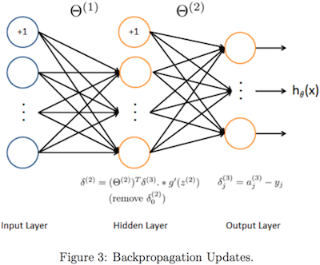
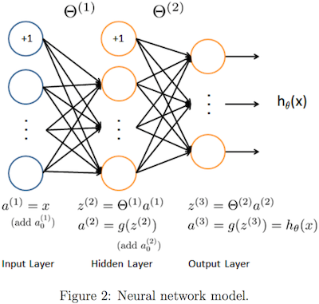

```{r setup, include=FALSE}
knitr::opts_chunk$set(echo = TRUE,  message=FALSE, warning=FALSE, 
                      fig.align = "center", fig.width = 6, fig.height = 4, 
                      rows.print = 5)
```
# Environment
```{r}
rm(list=ls())
set.seed(1)
library(dplyr)
library(gridExtra)
library(RColorBrewer)
library(directlabels)
library(knitr)
library(R.matlab)
library(kableExtra)
library(ggplot2)
library(plotly)
f <- list(family = "Courier New, monospace", 
          size = 18, 
          color = "#7f7f7f")
```

# Function

## load and show data
```{r}
load <- function(path, header = FALSE){
  data <- read.csv(path, header = header)
  X <<- data[, 1:(dim(data)[2] - 1)]
  y <<- data[, dim(data)[2]]
  data
}
```

## show dataframe
```{r}
showdf <- function(df, title = ''){
  df %>% 
    kable(format = 'html', caption = title, digit = 4) %>%
    kable_styling(bootstrap_options = c('striped', 'hover'))
}
```

## map variables to higher polynomial degree
```{r}
# input matrix X isn't included 1 column
mapFeature <- function(X, degree = 1){
  m <- dim(X)[1]; n <- dim(X)[2]
  mf <- rep(1, m)
  if(n == 1){
    for (i in 1:degree) mf <- cbind(mf, X[, 1] ^ i)
  }else if(n == 2){
    for(i in 1:degree){
      for(j in 0:i) mf <- cbind(mf, X[, 1] ^ (i - j) * X[, 2] ^ j)
    }
  }
  colnames(mf) <- paste('x', 0:(dim(mf)[2] - 1), sep = '')
  return(mf)
}
```

## sigmoid function
$$
g(z)=\dfrac{1}{1+e^{-z}}
$$
```{r}
sigmoid <- function(z){
  return(1 / (1 + exp(-z)))
}
```

### ggplot
```{r}
ggplot() + 
  stat_function(fun = sigmoid) +
  xlim(-10, 10) +
  ggtitle('Sigmoid Function') +
  xlab('x') +
  ylab('f(x)')
```

### plotly  
```{r}
x <- seq(-10, 10, length = 100)
plot_ly(x = x, y = sigmoid(x),
        mode = 'lines', type = 'scatter') %>%
  layout(title = 'Sigmoid Function',
         xaxis = list(title = 'x', titlefont = f),
         yaxis = list(title = 'f(x)', titlefont = f))
```

## gradient of the sigmoid function
$$
g'(z)=
\dfrac{d}{dz}g(z)=
g(z)(1-g(z))
$$
```{r}
sigmoidGradient <- function(z) {
    return(sigmoid(z) * (1 - sigmoid(z)))
}
```

## normal equation
$$
\theta=
\left(X^TX+\lambda
\begin{bmatrix}
0 & 0  & \cdots & 0 \\
0 & 1  & \cdots & 0 \\
\vdots & \vdots & \ddots & \vdots \\
0 & 0 & \cdots & 1 \\
\end{bmatrix}
\right)^{-1}X^Ty
$$
```{r}
normalEquation <- function(X, y, lambda = 0){
  n <- dim(X)[2]
  regular <- lambda * diag(1, n)
  regular[1, 1] <- 0 
  theta = solve(t(X) %*% X + regular) %*% t(X) %*% y
  rownames(theta) <- paste('theta', 0:(n - 1), sep = '')
  return(theta)
}
```

## cost function
$$
\mbox{Linear Regression}\\
h_{\theta}(x^{(i)})=
(x^{(i)})^T\theta\\
J(\theta)=
\dfrac{1}{2m}\sum\limits_{i=1}^m\left(h_{\theta}(x^{(i)})-y^{(i)}\right)^2+\dfrac{\lambda}{2m}\sum\limits_{j=1}^n\theta_j^2=
\dfrac{1}{2m}(X\theta-y)^T(X\theta-y)+\dfrac{\lambda}{2m}\sum\limits_{j=1}^n\theta_j^2
\\
$$
$$
\mbox{Logistic Regression}\\
h_{\theta}(x^{(i)})
=g(\theta^Tx^{(i)})
=\dfrac{1}{1+e^{-\theta^Tx^{(i)}}}
=Pr(y=1|x^{(i)};\theta)\\
\begin{align}
J(\theta)
&=\dfrac{1}{m}\sum\limits_{i=1}^mCost(h_{\theta}(x^{(i)}),y^{(i)})+\frac{\lambda}{2m}\sum\limits_{j=1}^n\theta_j^2\\
&=\dfrac{1}{m}\left[\sum\limits_{i=1}^m-y^{(i)}\log h_{\theta}(x^{(i)})-(1-y^{(i)})\log (1-h_{\theta}(x^{(i)}))\right]+\frac{\lambda}{2m}\sum\limits_{j=1}^n\theta_j^2\\
&=\dfrac{1}{m}\left[-y^t\log h_{\theta}(X)-(1-y)^T\log (1-h_{\theta}(X))\right]+\frac{\lambda}{2m}\sum\limits_{j=1}^n\theta_j^2\\
&=\dfrac{1}{m}\left[-y^t\log g(X\theta)-(1-y)^T\log (1-g(X\theta))\right]+\frac{\lambda}{2m}\sum\limits_{j=1}^n\theta_j^2
\end{align}
$$
```{r}
costFunction <- function(X, y, theta, lambda = 0, type = c('lin', 'log')){
  m <- dim(X)[1]
  pt <- theta
  pt[1] <- 0
  A <- lambda / (2 * m) * t(pt) %*% pt
  if(type == 'lin') {
    return(t(X %*% theta - y) %*% (X %*% theta - y) / (2 * m) + A)
  }
  else if(type == 'log'){
    h <- sigmoid(X %*% theta)
    return(1 / m * (-t(y) %*% log(h) - t(1 - y) %*% log(1 - h)) + A)
  }
}
```

## gradient operator
$$
\mbox{Linear Regression}\\
\nabla_{\theta}J=
\dfrac{\partial}{\partial\theta_j}J(\theta)=
\dfrac{1}{m}X^T(X\theta-y)+\frac{\lambda}{m}
\begin{bmatrix}
0\\
\theta_1\\
\theta_2\\
\vdots\\
\theta_n
\end{bmatrix}
$$
$$
\mbox{Logistic Regression}\\
\nabla_{\theta}J=
\dfrac{\partial}{\partial\theta_j}J(\theta)=
\begin{bmatrix}
\frac{1}{m}\sum_{i=1}^m\left(h_{\theta}(x^{(i)})-y^{(i)}\right)x_0^{(i)}+0\\
\frac{1}{m}\sum_{i=1}^m\left(h_{\theta}(x^{(i)})-y^{(i)}\right)x_1^{(i)}+\frac{\lambda}{m}\theta_1\\
\frac{1}{m}\sum_{i=1}^m\left(h_{\theta}(x^{(i)})-y^{(i)}\right)x_2^{(i)}+\frac{\lambda}{m}\theta_2\\
\vdots\\
\frac{1}{m}\sum_{i=1}^m\left(h_{\theta}(x^{(i)})-y^{(i)}\right)x_n^{(i)}+\frac{\lambda}{m}\theta_n
\end{bmatrix}
=
\frac{1}{m}X^T\left(h_{\theta}(X)-y\right)+\frac{\lambda}{m}
\begin{bmatrix}
0\\
\theta_1\\
\theta_2\\
\vdots\\
\theta_n
\end{bmatrix}
$$
```{r}
gradientFunction <- function(X, y, theta, lambda = 0, type = c('lin', 'log')){
  m <- dim(X)[1]
  G <- lambda / m * theta
  G[1] <- 0
  if(type == 'lin') return(1 / m * t(X) %*% (X %*% theta - y) + G)
  else if(type == 'log'){
    h <- sigmoid(X %*% theta)
    return(1 / m * t(X) %*% (h - y) +  G)
  }
}
```

## hessian matrix
$$
H=
\frac{1}{m}\left[\sum\limits_{i=1}^mh_{\theta}(x^{(i)})(1-h_{\theta}(x^{(i)}))x^{(i)}\left(x^{(i)}\right)^T\right]
+
\frac{\lambda}{m}
\begin{bmatrix}
0&&&\\
&1&&\\
&&\ddots&\\
&&&1
\end{bmatrix}
$$
```{r}
hessian <- function (X, y, theta, lambda = 0) {
  m <- dim(X)[1]
  n <- dim(X)[2]
  L <- lambda / m * diag(n)
  L[1, 1] <- 0
  h <- sigmoid(X %*% theta)
  return(1 / m * t(X) %*% X * diag(h) * diag(1 - h) + L)
}
```

## compute theta by iterations
$$
\mbox{Linear Regression}\\
\theta:=
\theta-\alpha\nabla_{\theta}J
$$
$$
\mbox{Logistic Regression}\\
\theta:=\theta-H^{-1}\nabla_{\theta}J
$$
```{r}
computeTheta <- function(X, y, theta, alpha = 0, lambda = 0, num_iters, 
                         type = c('lin', 'log')){
  n <- length(theta)
  theta_vals <- theta
  J_vals <- rep(0, num_iters)
  if(type == 'lin'){
    for (i in 1:num_iters){
      theta_vals <- rbind(theta_vals, t(theta))
      J_vals[i] <- costFunction(X, y, theta, lambda, type = type)
      theta <- theta - alpha * gradientFunction(X, y, theta, lambda, type = type)
    }
  }else if(type == 'log'){
    for (i in 1:num_iters) {
      theta_vals <- rbind(theta_vals, t(theta))
      J_vals[i] = costFunction(X, y, theta, lambda, type = type)
      theta = theta - 
        solve(hessian(X, y, theta, lambda)) %*% 
        gradientFunction(X, y, theta, lambda, type = type)
    }
  }
  rownames(theta) <- paste('theta', 0:(n - 1), sep = '')
  return(list(theta = theta, theta_vals = theta_vals, J_vals = J_vals)) 
}
```

## one vs all
```{r}
oneVsAll <- function(X, y, lambda = 0, num_iters, num_labels, method = c('matrix', 'optim')){
  n <- dim(X)[2]
  alpha <- 0
  type <- 'log'
  for (c in 1:num_labels){
    theta_ini <- rep(0, n)
    if(method == 'matrix')
      theta <- computeTheta(X, (y == c), theta_ini, alpha, lambda, num_iters, type)$theta
    else
      theta <- optim(theta_ini, X = X, y = (y == c), lambda = lambda, type = type,
                 fn = costFunction, gr = gradientFunction,
                 method = "BFGS", control = list(maxit = num_iters))$par
    if(c == 1) all_theta <- t(theta)
    else all_theta <- rbind(all_theta, t(theta))
  }
  return(all_theta)
}
```

## one vs all predict
```{r}
predictOneVsAll <- function(all_theta, X){
  ps <- sigmoid(X %*% t(all_theta))
  return(apply(sigmoid(X %*% t(all_theta)), 1, which.max))
}
```

## display image
```{r}
displayData <- function(X, example_width = round(sqrt(dim(X)[2])))  {
  if (is.vector(X))
    X <- t(X)
  m <- dim(X)[1]
  n <- dim(X)[2]
  example_height <- (n / example_width) #20
  display_rows <- floor(sqrt(m)) #10
  display_cols <- ceiling(m / display_rows) #10
  pad <- 1
  display_array <-
    -matrix(0,pad + display_rows * (example_height + pad),
            pad + display_cols * (example_width + pad))
  curr_ex <- 1
  for (j in 1:display_rows) {
    for (i in 1:display_cols) {
      if (curr_ex > m)
        break
      max_val <- max(abs(X[curr_ex,]))
      display_array[pad + (j - 1) * (example_height + pad) + (1:example_height),
                    pad + (i - 1) * (example_width + pad) + (1:example_width)] <-
        matrix(X[curr_ex,], example_height, example_width) / max_val
      curr_ex <- curr_ex + 1
    }
    if (curr_ex > m)
      break
  }
  op <- par(bg = "gray")
  display_array <- t(apply(display_array,2,rev))
  image(
    z = display_array,col = gray.colors(100), xaxt = 'n',yaxt = 'n'
  )
  grid(
    nx = display_cols,display_rows,col = 'black',lwd = 2,lty = 1
  )
  box()
  par(op)
}
```

## neural network cost function
$$
h_{\Theta}(x)\in R^K\\
(h_{\Theta}(x))_i=i^{\text{th}}\text{ output}\\
\begin{align}
J(\Theta)&=
-\dfrac{1}{m}\left[\sum\limits_{i=1}^m\sum\limits_{k=1}^Ky_k^{(i)}\log (h_{\Theta}(x^{(i)}))_k+(1-y_k^{(i)})\log (1-(h_{\Theta}(x^{(i)}))_k)\right]\\
&+\dfrac{\lambda}{2m}\sum\limits_{l=1}^{L-1}\sum\limits_{i=1}^{s_l}\sum\limits_{j=1}^{s_l+1}(\Theta_{ji}^{(l)})^2
\end{align}
$$
```{r}
nnCostFunction  <-
  function(input_layer_size, hidden_layer_size, num_labels,X, y, lambda) {
    function(nn_params) {
      m <- dim(X)[1]
      Theta1 <-
        matrix(nn_params[1:(hidden_layer_size * (input_layer_size + 1))],
               hidden_layer_size, (input_layer_size + 1))
      Theta2 <-
        matrix(nn_params[(1 + (hidden_layer_size * (input_layer_size + 1))):length(nn_params)],
               num_labels, (hidden_layer_size + 1))
      I <- diag(num_labels)
      Y <- matrix(0, m, num_labels)
      for (i in 1:m)
        Y[i,] <- I[y[i],]
      a1 <- cbind(rep(1,m),X)
      z2 <- a1 %*% t(Theta1)
      a2 <- cbind(rep(1,dim(z2)[1]), sigmoid(z2))
      z3 <- a2 %*% t(Theta2)
      a3 <- sigmoid(z3)
      h <- a3
      p <- sum(Theta1[,-1] ^ 2) + sum(Theta2[,-1] ^ 2)
      return(sum((-Y) * log(h) - (1 - Y) * log(1 - h)) / m + lambda * p / (2 * m))
    }
  }
```

## neural network gradient function

```{r}
nnGradFunction  <-
  function(input_layer_size, hidden_layer_size, num_labels,
           X, y, lambda) {
    function(nn_params) {
      m <- dim(X)[1]
      Theta1 <-
        matrix(nn_params[1:(hidden_layer_size * (input_layer_size + 1))],
               hidden_layer_size, (input_layer_size + 1))
      Theta2 <-
        matrix(nn_params[(1 + (hidden_layer_size * (input_layer_size + 1))):length(nn_params)],
               num_labels, (hidden_layer_size + 1))
      I <- diag(num_labels)
      Y <- matrix(0, m, num_labels)
      for (i in 1:m)
        Y[i,] <- I[y[i],]
      a1 <- cbind(rep(1,m),X)
      z2 <- a1 %*% t(Theta1)
      a2 <- cbind(rep(1,dim(z2)[1]), sigmoid(z2))
      z3 <- a2 %*% t(Theta2)
      a3 <- sigmoid(z3)
      h <- a3
      sigma3 <- h - Y
      sigma2 <-
        (sigma3 %*% Theta2) * sigmoidGradient(cbind(rep(1,dim(z2)[1]),z2))
      sigma2 <- sigma2[,-1]
      delta_1 <- (t(sigma2) %*% a1)
      delta_2 <- (t(sigma3) %*% a2)
      p1 <- (lambda / m) * cbind(rep(0,dim(Theta1)[1]), Theta1[,-1])
      p2 <- (lambda / m) * cbind(rep(0,dim(Theta2)[1]), Theta2[,-1])
      Theta1_grad <- delta_1 / m + p1
      Theta2_grad <- delta_2 / m + p2
      grad <-  c(c(Theta1_grad), c(Theta2_grad))
      return(grad)
    }
  }
```

## randomly initialize the weights of a layer 
```{R}
randInitializeWeights <- function(L_in, L_out) {
  epsilon_init <- 0.12
  rnd <- runif(L_out * (1 + L_in))
  rnd <- matrix(rnd,L_out,1 + L_in)
  W <- rnd * 2 * epsilon_init - epsilon_init
  W
}
```

## neural network predict
```{r}
predict <- function(Theta1, Theta2, X) {
  if (is.vector(X))
    X <- t(X)
  m <- dim(X)[1]
  num_labels <- dim(Theta2)[1]
  p <- rep(0,dim(X)[1])
  h1 <- sigmoid(cbind(rep(1,m),X) %*% t(Theta1))
  h2 <- sigmoid(cbind(rep(1,m),h1) %*% t(Theta2))
  p <- apply(h2,1,which.max)
  p
}
```

## debugInitializeWeights
```{r}
debugInitializeWeights  <- function(fan_out, fan_in) {
  W <- matrix(0,fan_out,1 + fan_in)
  W <- matrix(sin(1:length(W)), dim(W)[1],dim(W)[2]) / 10
  W
}
```

## computeNumericalGradient
```{r}
computeNumericalGradient <- function(J, theta) {
  numgrad <- rep(0,length(theta))
  perturb <- rep(0,length(theta))
  e <- 1e-4
  for (p in 1:length(theta)) {
    perturb[p] <- e
    loss1 <- J(theta - perturb)
    loss2 <- J(theta + perturb)
    numgrad[p] <- (loss2 - loss1) / (2 * e)
    perturb[p] <- 0
  }
  numgrad
}
```

## checkNNGradients
```{r}
checkNNGradients <- function (lambda = 0) {
  input_layer_size <- 3
  hidden_layer_size <- 5
  num_labels <- 3
  m <- 5
  Theta1 <- debugInitializeWeights(hidden_layer_size, input_layer_size)
  Theta2 <- debugInitializeWeights(num_labels, hidden_layer_size)
  X  <- debugInitializeWeights(m, input_layer_size - 1)
  y  <- 1 + t(1:m %% num_labels)
  nn_params <- c(Theta1,Theta2)
  costFunc <- nnCostFunction(input_layer_size, hidden_layer_size,
                             num_labels, X, y, lambda)
  cost <- costFunc(nn_params)
  grad <- nnGradFunction(input_layer_size, hidden_layer_size,
                         num_labels, X, y, lambda)(nn_params)
  numgrad <- computeNumericalGradient(costFunc, nn_params)
  print(cbind(numgrad, grad))
  cat(
    sprintf(
      'The above two columns you get should be very similar.
      (Left-Your Numerical Gradient, Right-Analytical Gradient)\n\n'
    )
    )
  diff <-
    norm(as.matrix(numgrad - grad)) / norm(as.matrix(numgrad + grad))
  cat(
    sprintf(
      'If your backpropagation implementation is correct, then
      the relative difference will be small (less than 1e-9).
      Relative Difference: %g', diff
    )
    )
}
```

## lbfgsb3 faster than optim
```{r}
lbfgsb3_ <- function (prm, fn, gr = NULL, lower = -Inf, upper = Inf, control = list(), 
          ...)
{
  tasklist <- c("NEW_X", "START", "STOP", "FG", "ABNORMAL_TERMINATION_IN_LNSRCH", 
                "CONVERGENCE", "CONVERGENCE: NORM_OF_PROJECTED_GRADIENT_<=_PGTOL", 
                "CONVERGENCE: REL_REDUCTION_OF_F_<=_FACTR*EPSMCH", "ERROR: FTOL .LT. ZERO", 
                "ERROR: GTOL .LT. ZERO", "ERROR: INITIAL G .GE. ZERO", 
                "ERROR: INVALID NBD", "ERROR: N .LE. 0", "ERROR: NO FEASIBLE SOLUTION", 
                "ERROR: STP .GT. STPMAX", "ERROR: STP .LT. STPMIN", 
                "ERROR: STPMAX .LT. STPMIN", "ERROR: STPMIN .LT. ZERO", 
                "ERROR: XTOL .LT. ZERO", "FG_LNSRCH", "FG_START", "RESTART_FROM_LNSRCH", 
                "WARNING: ROUNDING ERRORS PREVENT PROGRESS", "WARNING: STP .eq. STPMAX", 
                "WARNING: STP .eq. STPMIN", "WARNING: XTOL TEST SATISFIED")
  ctrl <- list(maxit = 100, trace = 0, iprint = 0L)
  namc <- names(control)
  if (!all(namc %in% names(ctrl))) 
    stop("unknown names in control: ", namc[!(namc %in% 
                                                names(ctrl))])
  ctrl[namc] <- control
  iprint <- as.integer(ctrl$iprint)
  factr <- 1e+07
  pgtol <- 1e-05
  nmax <- 26260
  mmax <- 17L
  if (length(prm) > nmax) 
    stop("The number of parameters cannot exceed 1024")
  n <- as.integer(length(prm))
  m <- 5L
  nbd <- rep(2L, n)
  nwa <- 2 * mmax * nmax + 5 * nmax + 11 * mmax * mmax + 8 * 
    mmax
  wa <- rep(0, nwa)
  dsave <- rep(0, 29)
  lsave <- rep(TRUE, 4)
  isave <- rep(0L, 44)
  iwa <- rep(0L, 3 * nmax)
  csave <- ""
  if (length(lower) == 1) 
    lower <- rep(lower, n)
  if (length(upper) == 1) 
    upper <- rep(upper, n)
  bigval <- .Machine$double.xmax/10
  for (i in 1:n) {
    if (is.finite(lower[i])) {
      if (is.finite(upper[i])) 
        nbd[i] <- 2
      else {
        nbd[i] <- 1
        upper[i] <- bigval
      }
    }
    else {
      if (is.finite(upper[i])) {
        nbd[i] <- 3
        lower[i] <- -bigval
      }
      else {
        nbd[i] <- 0
        upper[i] <- bigval
        lower[i] <- -bigval
      }
    }
  }
  itask <- 2L
  task <- tasklist[itask]
  f <- .Machine$double.xmax/100
  g <- rep(f, n)
  icsave <- 0
  repeat {
    if (isave[34] > ctrl$maxit )
      break
    
    if (ctrl$trace >= 2) {
      cat("Before call, f=", f, "  task number ", itask, 
          " ")
      print(task)
    }
    possibleError <- tryCatch(
    result <- .Fortran("lbfgsb3", n = as.integer(n), m = as.integer(m), 
                       x = as.double(prm), l = as.double(lower), u = as.double(upper), 
                       nbd = as.integer(nbd), f = as.double(f), g = as.double(g), 
                       factr = as.double(factr), pgtol = as.double(pgtol), 
                       wa = as.double(wa), iwa = as.integer(iwa), itask = as.integer(itask), 
                       iprint = as.integer(iprint), icsave = as.integer(icsave), 
                       lsave = as.logical(lsave), isave = as.integer(isave), 
                       dsave = as.double(dsave))
    , error = function(e) e)
    
    if(inherits(possibleError, "error"))
      break
    
    
    itask <- result$itask
    icsave <- result$icsave
    prm <- result$x
    g <- result$g
    iwa <- result$iwa
    wa <- result$wa
    nbd <- result$nbd
    lsave <- result$lsave
    isave <- result$isave
    dsave <- result$dsave
    if (ctrl$trace > 2) {
      cat("returned from lbfgsb3\n")
      cat("returned itask is ", itask, "\n")
      task <- tasklist[itask]
      cat("changed task to ", task, "\n")
    }
    if (itask %in% c(4L, 20L, 21L)) {
      if (ctrl$trace >= 2) {
        cat("computing f and g at prm=")
        print(prm)
      }
      f <- fn(prm, ...)
      if (is.null(gr)) {
        g <- grad(fn, prm, ...)
      }
      else {
        g <- gr(prm, ...)
      }
      if (ctrl$trace > 0) {
        cat("At iteration ", isave[34], " f =", f)
        if (ctrl$trace > 1) {
          cat("max(abs(g))=", max(abs(g)))
        }
        cat("\n")
      }
    }
    else {
      if (itask == 1L) {
      }
      else break
    }
  }
  info <- list(task = task, itask = itask, lsave = lsave, 
               icsave = icsave, dsave = dsave, isave = isave)
  ans <- list(prm = prm, f = f, g = g, info = info)
}
```

# Simple Linear Regression

## calculate theta
```{r, results = 'asis'}
path = 'data/ex1data1.txt'
data <- read.csv(path, header = FALSE)
data
X <- t(t(data[, 1:(dim(data)[2] - 1)]))
y <- data[, dim(data)[2]]
X_std <- scale(X)
y_std <- scale(y)
X <- cbind(rep(1, dim(X)[1]), X)
X_std <- cbind(rep(1, dim(X_std)[1]), X_std)
# normal equation
theta <- normalEquation(X, y)
theta_std <- normalEquation(X_std, y_std)
# gradient descent
theta_ini <- c(5, -3)
alpha <- 0.01
lambda <- 0
num_iters <- 1000
result <- computeTheta(X, y, theta_ini, alpha, lambda, num_iters, type = 'lin')
result_std <- computeTheta(X_std, y_std, theta_ini, alpha, lambda, num_iters, type = 'lin')
# lm model
theta_glm <- glm(V2~., data = data)$coefficients
data.frame(theta_normal = theta,
           theta_grad = result$theta,
           theta_glm = theta_glm,
           theta_std = theta_std,
           theta_grad_std = result_std$theta) %>% showdf()
```

## scatter plot and regression line
```{r, fig.width = 12, fig.height = 4}
plot_x <- seq(min(X[, 2]), max(X[, 2]), length=100)
plot_y <- cbind(rep(1, length(plot_x)), plot_x) %*% c(theta[1],theta[2])
plot_x_std <- seq(min(X_std[, 2]), max(X_std[, 2]), length=100)
plot_y_std <- cbind(rep(1, length(plot_x_std)), plot_x_std) %*% c(theta_std[1],theta_std[2])
plot1 <- ggplot() +
  geom_point(aes(x = X[, 2], y = y), size = 2) +
  geom_path(aes(x = plot_x, y = plot_y), color = 'red') +
  labs(x = 'x', y = 'y')
plot2 <- ggplot() +
  geom_point(aes(x = X_std[, 2], y = y_std), size = 2) +
  geom_path(aes(x = plot_x_std, y = plot_y_std), color = 'red') +
  labs(x = 'normalized x', y = 'normalized y')
grid.arrange(plot1, plot2, ncol = 2)
```

## J_vals between (un)normalized
```{r, fig.width = 12, fig.height = 4}
plot1 <- ggplot() +
  geom_line(aes(x = 1:num_iters, y = result$J_vals)) +
  labs(x = 'iteraton', y = 'J_val(normalized)')
plot2<- ggplot() +
  geom_line(aes(x = 1:num_iters, y = result_std$J_vals)) +
  labs(x = 'iteraton', y = 'J_val(normalized)')
grid.arrange(plot1, plot2, ncol = 2)
```

## J_vals with different alpha
```{r}
num_iters <- 5
for(i in c(0.01, 0.02, 0.03)){
  assign(paste('result', i, sep = ''),
         computeTheta(X, y, theta = c(0, 0),
                       alpha = i, lambda = 0, num_iters = num_iters, type = 'lin'))
}
```

### ggplot
```{r}
ggplot() +
  geom_line(aes(x = 1:num_iters, y = result0.01$J_vals, colour = '0.01')) +
  geom_line(aes(x = 1:num_iters, y = result0.02$J_vals, colour = '0.02')) +
  geom_line(aes(x = 1:num_iters, y = result0.03$J_vals, colour = '0.03')) +
  labs(colour = 'alpha', x = 'iteration', y = 'J_val')
```

## J_vals surface plot
```{r}
length <- 100
theta0_vals <- seq(-10, 10, length = length)
theta1_vals <- seq(-4, 4, length = length)
J_vals <- J_vals_std <- matrix(0, length, length)
for (i in 1:length){
  for (j in 1:length){
    t <- c(theta0_vals[i], theta1_vals[j])
    J_vals[i, j] <- costFunction(X, y, theta = t, lambda = 0, type = 'lin')
    J_vals_std[i, j] <- costFunction(X_std, y_std, theta = t, lambda = 0, type = 'lin')
  }
}
```

### plotly
```{r}
plot_ly(x = theta0_vals, y = theta1_vals, z = J_vals) %>%
  add_surface() %>%
  layout(title = "",
         scene = list(xaxis = list(title = "Theta0"),
                      yaxis = list(title = "Theta1"),
                      zaxis = list(title = "J_val")))
plot_ly(x = theta0_vals, y = theta1_vals, z = J_vals_std) %>%
  add_surface() %>%
  layout(title = "",
         scene = list(xaxis = list(title = "Theta0"),
                      yaxis = list(title = "Theta1"),
                      zaxis = list(title = "J_val")))
```

## J_vals convergence path
```{r}
temp <- data.frame(x = rep(theta0_vals, each = length),
                   y = rep(theta1_vals, times = length))
contour <- cbind(temp, z = as.numeric(log(t(J_vals))))
contour_std <- cbind(temp, z = as.numeric(log(t(J_vals_std))))
```

### ggplot2
```{r, fig.width = 12, fig.height = 4}
plot1 <- ggplot()+
  geom_raster(data = contour, aes(x = x, y = y,fill = z), show.legend = FALSE) +
  geom_contour(data = contour, aes(x = x, y = y, z = z, colour = ..level..),
               colour = 'white', size = 0.5) +
  scale_fill_gradientn(colors = brewer.pal(3, "PuBuGn")) +
  geom_path(aes(x = result$theta_vals[, 1],
                y = result$theta_vals[, 2]),
            size = 1, colour = 'orange', alpha = 0.75) +
  geom_point(aes(x = result$theta_vals[1, 1],
                 y = result$theta_vals[1, 2]),
             size = 3, colour = 'blue',  alpha = 0.75) +
  geom_point(aes(x = result$theta[1],
                 y = result$theta[2]),
             size=3, colour = 'red', alpha = 0.75, shape = 4) +
  labs(fill="J_val", title = '', x = 'Theta0', y = 'Theta1')
plot1 <- direct.label(plot1, "bottom.pieces")
plot2<-ggplot()+
  geom_raster(data = contour_std, aes(x = x, y = y,fill = z), show.legend = FALSE) +
  geom_contour(data = contour_std, aes(x = x, y = y, z = z, colour = ..level..),
               colour = 'white', size = 0.5) +
  scale_fill_gradientn(colors = brewer.pal(3, "PuBuGn")) +
  geom_path(aes(x = result_std$theta_vals[, 1],
                y = result_std$theta_vals[, 2]),
            size = 1, colour = 'orange', alpha = 0.75) +
  geom_point(aes(x = result_std$theta_vals[1, 1],
                 y = result_std$theta_vals[1, 2]),
             size = 3, colour = 'blue',  alpha = 0.75) +
  geom_point(aes(x = result_std$theta[1],
                 y = result_std$theta[2]),
             size=3, colour = 'red', alpha = 0.75, shape = 4) +
  labs(fill="J_val", title = '', x = 'Theta0', y = 'Theta1')
plot2 <- direct.label(plot2, "bottom.pieces")
grid.arrange(plot1, plot2, ncol = 2)
```

### plotly
```{r}
plot1 <-
  plot_ly(x = theta0_vals, y = theta1_vals, z = log(t(J_vals)),
        type = "contour", contours = list(showlabels = TRUE), showscale = FALSE) %>%
  add_trace(x = result$theta_vals[1, 1],
            y = result$theta_vals[1, 2],
            mode = 'markers', type = 'scatter',
            marker = list(symbol = 'o', color = 'blue', size = 10)) %>%
  add_trace(x = result$theta_vals[, 1],
            y = result$theta_vals[, 2],
            mode = "lines", type = 'scatter', color = 'white') %>%
  add_trace(x = result$theta[1],
            y = result$theta[2],
            mode = "markers", type = 'scatter',
            marker = list(symbol = 'x', color = 'red', size = 10)) %>%
  layout(title = '',
         xaxis = list(title = "Theta0", titlefont = f),
         yaxis = list(title = "Theta1", titlefont = f),
         showlegend = FALSE)
plot2 <-
  plot_ly(x = theta0_vals, y = theta1_vals, z = log(t(J_vals_std)),
        type = "contour", contours = list(showlabels = TRUE), showscale = FALSE) %>%
  add_trace(x = result_std$theta_vals[1, 1],
            y = result_std$theta_vals[1, 2],
            mode = "markers", type = 'scatter',
            marker = list(symbol = 'o', color = 'blue', size = 10)) %>%
  add_trace(x = result_std$theta_vals[, 1],
            y = result_std$theta_vals[, 2],
            mode = "lines", type = 'scatter') %>%
  add_trace(x = result_std$theta[1],
            y = result_std$theta[2],
            mode = "markers", type = 'scatter',
            marker = list(symbol = 'x', color = 'red', size = 10)) %>%
  layout(title = '',
         xaxis = list(title = "Theta0", titlefont = f),
         yaxis = list(title = "Theta1", titlefont = f),
         showlegend = FALSE)
subplot(plot1, plot2)
```

# Multiple Linear Regression

## calculate theta
```{r}
path = "data/ex1data2.txt"
data <- read.csv(path, header = FALSE)
data
X <- cbind(rep(1, dim(data)[1]), scale(data[, 1:(dim(data)[2] - 1)]))
y <- data[, dim(data)[2]]
# normal equation
theta <- normalEquation(X, y)
# gradient descent
theta_ini <- rep(0, dim(X)[2])
lambda <- 0
num_iters <- 50
for (i in c(0.3, 0.1, 0.03, 0.01)){
  assign(paste('result', i, sep = ''),
         computeTheta(X, y, theta_ini, alpha = i, lambda, num_iters, type = 'lin'))
}
# lm model
theta_glm <- glm(V3~., data = data)$coefficient
data.frame(theta_normal = theta,
           theta_glm = theta_glm,
           theta_0.3 = result0.3$theta,
           theta_0.1 = result0.1$theta,
           theta_0.03 = result0.03$theta,
           theta_0.01 = result0.01$theta) %>% showdf()
```

## J_vals with different alpha
```{r}
ggplot() +
  geom_line(aes(x = 1:num_iters, y = result0.3$J_vals, colour = '0.3'),
            size = 1, alpha = 0.75, show_guide = TRUE) +
  geom_line(aes(x = 1:num_iters, y = result0.1$J_vals, colour = '0.1'),
            size = 1, alpha = 0.75, show_guide = TRUE) +
  geom_line(aes(x = 1:num_iters, y = result0.03$J_vals, colour = '0.03'),
            size = 1, alpha = 0.75, show_guide = TRUE) +
  geom_line(aes(x = 1:num_iters, y = result0.01$J_vals, colour = '0.01'),
            size = 1, alpha = 0.75, show_guide = TRUE) +
  labs(colour = 'alpha', title = 'Normalized X', x = 'iteration', y = 'J_val')
```

# Logistic Regression

## calculate theta
```{r}
path <- "data/ex2data1.txt"
data <- read.csv(path, header = FALSE)
data
X <- mapFeature(data[, 1:(dim(data)[2] - 1)])
y <- data[, dim(data)[2]]
data <- data.frame(X, y)
# gradient descent
theta <- rep(0, dim(X)[2])
alpha <- 0
lambda <- 0
num_iters <- c(10, 100, 1000)
for(i in num_iters){
  assign(paste('result', i, sep = ''),
         computeTheta(X, y, theta, alpha, lambda, num_iters = i, type = 'log'))
}
# 使用opti替代octave中的fminunc找最優解
theta_opt <- optim(par = theta, X = X, y = y, lambda = lambda, type = 'log',
                   fn = costFunction, gr = gradientFunction,
                   method = "Nelder-Mead", control = list(maxit = 1000))$par
# 使用glm
theta_glm <- glm(y~., data = data[, -1], family = "binomial")$coefficients
theta <- data.frame(theta_10 = result10$theta,
                    theta_100 = result100$theta,
                    theta_1000 = result1000$theta,
                    theta_optim = theta_opt,
                    theta_glm = theta_glm)
theta %>% showdf()
acc <- rep(0, 5)
for(i in 1:5){
  acc[i] <- paste(mean((sigmoid(as.matrix(data[, 1:(dim(data)[2] - 1)]) %*% theta[, i]) >= 0.5) == data[, dim(data)[2]]) * 100, '%', sep = '')
}
acc <- data.frame(theta_10 = acc[1],
                  theta_100 = acc[2],
                  theta_1000 = acc[3],
                  theta_optim = acc[4],
                  theta_glm = acc[5])
rownames(acc) <- 'Accurate'
acc %>% showdf()
```

### ggplot
```{r}
plot_gg <- ggplot() +
  geom_point(data = data, aes(x1, x2, colour = factor(y), shape = factor(y)),
             size = 3, alpha = 0.75) +
  scale_shape_manual(values = c(4, 16),
                     guide = guide_legend(reverse = TRUE),
                     name = '',
                     breaks = c("0", "1"),
                     labels = c("Not Admitted", "Admitted")) +
  scale_colour_manual(values = c('red','blue'),
                      guide = guide_legend(reverse = TRUE),
                      name = '',
                      breaks = c("0", "1"),
                      labels = c("Not Admitted", "Admitted")) +
  labs(title = '', x = 'Exam 1 score', y = 'Exam 2 score') +
  theme(legend.position="bottom")
plot_gg
```

### plotly
```{r}
trace1 <- data[data[, 'y'] == 0,]
trace2 <- data[data[, 'y'] == 1,]
plot_pl <- plot_ly() %>%
  add_trace(data = trace2, x = ~x1, y = ~x2, name = 'Admitted',
            mode = "markers", type = 'scatter',
            marker = list(symbol = 'o', color = 'blue', size = 10),
            showlegend = TRUE) %>%
  add_trace(data = trace1, x = ~x1, y = ~x2, name = 'Not Admitted',
                 mode = "markers", type = 'scatter',
                 marker = list(symbol = 'x', color = 'red', size = 10),
            showlegend = TRUE) %>%
  layout(title = '',
         xaxis = list(title = 'exam1 score',
                      range = c(min(data$x1) - 2, max(data$x1) + 2),
                      titlefont = f),
         yaxis = list(title = 'exam2 score',
                      range = c(min(data$x2) - 2, max(data$x2) + 2),
                      titlefont = f))
plot_pl
```

## J_vals with different iteration

### ggplot
```{r, fig.width=18, fig.height=4}
plot1 <- ggplot() + geom_line(aes(x = 1:num_iters[1], y = result10$J_vals)) +
  labs(title = '', x = 'iteraion', y = 'J_vals')
plot2 <- ggplot() + geom_line(aes(x = 1:num_iters[2], y = result100$J_vals)) +
  labs(title = '', x = 'iteraion', y = 'J_vals')
plot3 <- ggplot() + geom_line(aes(x = 1:num_iters[3], y = result1000$J_vals)) +
  labs(title = '', x = 'iteraion', y = 'J_vals')
grid.arrange(plot1, plot2, plot3, ncol = 3)
```

### plotly
```{r}
plot1 <- plot_ly(x = 1:num_iters[1], y = result10$J_vals, mode = 'line', name = 'iter=10')
plot2 <- plot_ly(x = 1:num_iters[2], y = result100$J_vals, mode = 'line', name = 'iter=100')
plot3 <- plot_ly(x = 1:num_iters[3], y = result1000$J_vals, mode = 'line', name = 'iter=1000')
subplot(plot1, plot2, plot3) %>%
  layout(yaxis = list(title = "J_val",
                      titlefont = f),
         legend = list(orientation = 'h'))
```

## dicision boundary
$$
\theta_0+\theta_1x_1+\theta_2x_2=0\\
\Rightarrow
x_2
=\dfrac{-1}{\theta_2}\times[\theta_1x_1+\theta_0]
$$
```{r}
theta <- result1000$theta
plot_x = c(min(X[, 2]), max(X[, 2]))
plot_y = -1 / theta[3] * (theta[2] * plot_x + theta[1])
trace3 <- data.frame(x = plot_x, y = plot_y)
```

### ggplot
```{r, fig.width=12, fig.height=4}
plot1 <-
  plot_gg + geom_path(data = trace3, aes(x = x, y = y),
                     colour = 'orange', size = 1, alpha = 0.75) +
  labs(title = 'Dicision Boundary') +
  coord_cartesian(xlim = c(min(data$x1), max(data$x1)),
                  ylim = c(min(data$x2), max(data$x2))) +
  theme(legend.position = 'none')
y_pre <- sigmoid(as.matrix(data[, 1:(dim(data)[2] - 1)]) %*% theta) >= 0.5
data_pre <- cbind(data, y_pre)
plot2 <-
  ggplot() +
  geom_point(data = data_pre, aes(x1, x2, colour = factor(y_pre), shape = factor(y_pre)),
             size = 3, alpha = 0.75) +
  scale_shape_manual(values = c(4, 16)) +
  scale_colour_manual(values = c('red','blue')) +
  geom_path(data = trace3, aes(x = x, y = y),
                     colour = 'orange', size = 1, alpha = 0.75) +
  labs(title = 'Dicision Boundary(predict)', x = 'Exam 1 score', y = 'Exam 2 score') +
  coord_cartesian(xlim = c(min(data$x1), max(data$x1)),
                  ylim = c(min(data$x2), max(data$x2))) +
  theme(legend.position = 'none')
grid.arrange(plot1, plot2, ncol = 2)
```

### plotly
```{r}
plot_ly() %>%
  add_trace(data = trace2, x = ~x1, y = ~x2, name = 'Admitted',
            mode = "markers", type = 'scatter',
            marker = list(symbol = 'o', color = 'blue', size = 10), showlegend = TRUE) %>%
  add_trace(data = trace1, x = ~x1, y = ~x2, name = 'Not Admitted',
                 mode = "markers", type = 'scatter',
                 marker = list(symbol = 'x', color = 'red', size = 10), showlegend = TRUE) %>%
  add_trace(data = trace3, x = ~x, y = ~y, mode = 'lines', name = 'Dicision Boundary') %>%
  layout(xaxis = list(title = 'exam1 score', titlefont = f,
                      range = c(min(data$x1) - 2, max(data$x1 + 2))),
         yaxis = list(title = 'exam2 score', titlefont = f,
                      range = c(min(data$x2) - 2, max(data$x2 + 2))))
```

# Regularized Logistic Regression

## calculate theta
```{r}
path = "data/ex2data2.txt"
data <- read.csv(path, header = FALSE)
data
X <- mapFeature(data[, 1:(dim(data)[2] - 1)], 6)
y <- data[, dim(data)[2]]
data <- data.frame(X, y)
# gradient descent, set lambda = 0, 1, 100
theta <- rep(0, dim(X)[2])
lambda <- c(0, 1, 100)
num_iters <- 100
j <- 1
for(i in lambda){
  assign(paste('result', j, sep = ''),
         computeTheta(X, y, theta, alpha, lambda = i, num_iters, type = 'log'))
  j <- j + 1
}
# opti, set lambda = 0, 1, 100
j <- 4
for(i in lambda){
  assign(paste('result', j, sep = ''),
         optim(par = theta, X = X, y = y, lambda = i, type = 'log',
                    fn = costFunction, gr = gradientFunction,
                    method = "BFGS"))
  j <- j + 1
}
# glm
result7 <- glm(y~., data = data[, -1], family = "binomial")
theta <- data.frame(theta_0 = result1$theta,
                    theta_1 = result2$theta,
                    theta_100 = result3$theta,
                    theta_opt0 = result4$par,
                    theta_opt1 = result5$par,
                    theta_opt100 = result6$par,
                    theta_glm = result7$coefficients)
theta[1:5, ] %>% showdf()
acc <- rep(0, 7)
for(i in 1:7){
  acc[i] <- paste(round(mean((sigmoid(as.matrix(data[, 1:(dim(data)[2] - 1)]) %*% theta[, i]) >= 0.5) == data[, dim(data)[2]]) * 100, 2), '%', sep = '')
}
acc <- data.frame(theta_0 = acc[1],
                  theta_1 = acc[2],
                  theta_100 = acc[3],
                  theta_opt0 = acc[4],
                  theta_opt1 = acc[5],
                  theta_opt100 = acc[6],
                  theta_glm = acc[7])
rownames(acc) <- 'Accurate'
acc %>% showdf()
```

### ggplot
```{r}
plot_gg <- ggplot() +
  geom_point(aes(x = data[data$y == 1, ]$x1, y = data[data$y == 1, ]$x2,
                 colour = 'Accepted', shape = 'Accepted')) +
  geom_point(aes(x = data[data$y == 0, ]$x1, y = data[data$y == 0, ]$x2,
                 colour = 'Rejected', shape = 'Rejected')) +
  scale_shape_manual(values = c(16, 4)) +
  labs(title = '', x = 'Microchip Test 1', y = 'Microchip Test 2', colour = '', shape = '')
plot_gg
```

### plotly
```{r}
trace1 <- data[data[, 'y'] == 1,]
trace2 <- data[data[, 'y'] == 0,]
plot_ly() %>%
  add_trace(data = trace1, x = ~x1, y = ~x2, name = 'Accepted',
            mode = "markers", type = 'scatter',
            marker = list(symbol = 'o', color = 'blue', size = 10)) %>%
  add_trace(data = trace2, x = ~x1, y = ~x2, name = 'Rejected',
            mode = "markers", type = 'scatter',
            marker = list(symbol = 'x', color = 'red', size = 10)) %>%
  layout(title = '',
         xaxis = list(title = 'Microchip Test 1',
                      titlefont = f),
         yaxis = list(title = 'Microchip Test 2',
                      titlefont = f))
```

## J_vals with different lambda

### ggplot
```{r}
ggplot() +
  geom_line(aes(x = 1:num_iters, y = result1$J_vals, colour = '0')) +
  geom_line(aes(x = 1:num_iters, y = result2$J_vals, colour = '1')) +
  geom_line(aes(x = 1:num_iters, y = result3$J_vals, colour = '100')) +
  labs(title = '', x = 'iteraion', y = 'J_vals', colour = 'lambda')
```

### plotly
```{r}
plot_ly() %>%
  add_trace(x = 1:num_iters, y = result1$J_vals, mode = 'line', name = 'lambda=0') %>%
  add_trace(x = 1:num_iters, y = result2$J_vals, mode = 'line', name = 'lambda=1') %>%
  add_trace(x = 1:num_iters, y = result3$J_vals, mode = 'line', name = 'lambda=100') %>%
  layout(title = '',
         xaxis = list(title = "iteraion",
                      titlefont = f),
         yaxis = list(title = "J_vals",
                      titlefont = f))
```

## dicision boundary
```{r}
drawLength <- 50
u <- v <- seq(-1, 1.5, length = drawLength)
for(i in 1:7) assign(paste('z', i, sep=''), matrix(0, drawLength, drawLength))
z <- list(z1, z2, z3, z4, z5, z6, z7)
for(k in 1:7){
  for(i in 1:drawLength){
    for(j in 1:drawLength){
        z[[k]][j, i] <- mapFeature(cbind(u[i], v[j]), 6) %*% theta[, k]
    }
  }
}
coor<- data.frame(x = rep(u, each = drawLength),
                  y = rep(v, times = drawLength))
contour_list <- list(z1 = cbind(coor, z = c(z[[1]])),
                     z2 = cbind(coor, z = c(z[[2]])),
                     z3 = cbind(coor, z = c(z[[3]])),
                     z4 = cbind(coor, z = c(z[[4]])),
                     z5 = cbind(coor, z = c(z[[5]])),
                     z6 = cbind(coor, z = c(z[[6]])),
                     z7 = cbind(coor, z = c(z[[7]])))
```

### ggplot
```{r, fig.width=18, fig.height=12}
j <- 1
for(i in c('lambda=0', 'lambda=1', 'lambda=100',
           'opti lambda=0','opti lambda=1','opti lambda=100',
           'glm')){
  assign(paste('plot', j, sep = ''),
         plot_gg +
           geom_contour(data = contour_list[[j]], aes(x = x, y = y, z = z),
                        bins = 1, alpha = 0.75, size = 1) +
           labs(title = i) +
           coord_cartesian(xlim = c(min(data$x1), max(data$x1)),
                           ylim = c(min(data$x2), max(data$x2))) +
           theme(legend.position = "none"))
j <- j + 1
}
grid.arrange(plot1, plot2, plot3, plot4, plot5, plot6, plot7, ncol = 3)
```

### plotly
```{r}
plot_ly() %>%
  add_trace(data = trace1, x = ~x1, y = ~x2, name = 'Accepted',
            mode = "markers", type = 'scatter',
            marker = list(symbol = 'o', color = 'blue', size = 10)) %>%
  add_trace(data = trace2, x = ~x1, y = ~x2, name = 'Rejected',
            mode = "markers", type = 'scatter',
            marker = list(symbol = 'x', color = 'red', size = 10)) %>%
  add_trace(x = u, y = v, z = z[[2]],
            type = "contour", showscale = FALSE,
            contours = list(coloring = 'lines',
                            showlabels = TRUE),
            line = list(width = 2)) %>%
  layout(title = 'Dicision Boundary',
         xaxis = list(title = 'Microchip Test 1',
                      titlefont = f,
                      range = c(min(data$x1) - 0.1, max(data$x1) + 0.1)),
         yaxis = list(title = 'Microchip Test 2',
                      titlefont = f,
                      range = c(min(data$x2) - 0.1, max(data$x2) + 0.1)))
```

# Multi-class Classification
```{r, fig.width=6, fig.height=6}
path <- "data/ex3data1.mat"
data <- readMat(path)
X <- cbind(rep(1, dim(data$X)[1]), data$X)
y <- data$y
```

## display image
```{r, fig.width=6,fig.height=6}
displayData(X[sample(dim(X)[1])[1:100], -1])
```

## calculate theta and accuracy
```{r}
msg1 <- c('Use matrix\n')
for(i in c(0.1)){
  for(j in c(3:3)){
    all_theta <- oneVsAll(X, y, lambda = i, num_iters = j, num_labels = 10, method = 'matrix')
    pred <- predictOneVsAll(all_theta, X)
    accu <- round(mean(pred == y) * 100, 2)
    msg1 <- paste(msg1,
                  paste("Training Set Accuracy with num_iters=", j, "& lambda=", i, "is:", accu, "%\n"))
  }
}
msg2 <- c('Use optim\n')
for(i in c(0.1)){
  for(j in c(50)){
    all_theta <- oneVsAll(X, y, lambda = i, num_iters = j, num_labels = 10, method = 'optim')
    pred <- predictOneVsAll(all_theta, X)
    accu <- round(mean(pred == y) * 100, 2)
    msg2 <- paste(msg2,
                  paste("Training Set Accuracy with num_iters=", j, "& lambda=", i, "is:", accu, "%\n"))
  }
}
cat(paste(msg1, msg2, sep = ''))
```

# Neural Networks
```{r}
path <- "data/ex3data1.mat"
data <- readMat(path)
X <- cbind(rep(1, dim(data$X)[1]), data$X)
y <- data$y
path <- "data/ex3weights.mat"
data <- readMat(path)
Theta1 <- data$Theta1
Theta2 <- data$Theta2
```

## feedforward propagation and prediction


```{r}
z1 <- X %*% t(Theta1)
h1 <- sigmoid(z1)
h1 <- cbind(rep(1, length = dim(h1)[1]), h1)
z2 <- h1 %*% t(Theta2)
h2 <- sigmoid(z2)
pred <- apply(h2, 1, which.max)
accu <- mean(pred == y) * 100
cat("Training Set Accuracy is:", accu, "%\n")
```

## J_vals with different lambda
```{r}
X <- X[, -1]
nn_params <-c(c(Theta1), c(Theta2))
input_layer_size <- dim(X)[2]
hidden_layer_size <- 25
num_labels <- 10
J_vals <- rep(0, 20)
for(i in 1:length(J_vals)){
J_vals[i] <- 
  nnCostFunction(input_layer_size, hidden_layer_size, num_labels, X, y, lambda = i - 1)(nn_params)
}
ggplot() + geom_line(aes(x = 1:length(J_vals), y = J_vals)) +
  labs(x = 'lambda', y = 'J_val')
```

## backpropagation
```{r}
lambda <- 1
initial_Theta1 <- randInitializeWeights(input_layer_size, hidden_layer_size)
initial_Theta2 <- randInitializeWeights(hidden_layer_size, num_labels)
initial_nn_params <- c(initial_Theta1, initial_Theta2)
costFunction <- nnCostFunction(input_layer_size, hidden_layer_size,
                                   num_labels, X, y, lambda)
gradFunction <- nnGradFunction(input_layer_size, hidden_layer_size,
                               num_labels, X, y, lambda)
# use optim
nn_params <- optim(par = initial_nn_params,
                   fn = costFunction, gr = gradFunction,
                   method = "BFGS", control = list(trace = 1, maxit = 50))$par
Theta1 <- matrix(nn_params[1:(hidden_layer_size * (input_layer_size + 1))],
                 hidden_layer_size,
                 (input_layer_size + 1))
Theta2 <- matrix(nn_params[(1 + (hidden_layer_size * (input_layer_size + 1))):length(nn_params)],
                 num_labels,
                 (hidden_layer_size + 1))
mean(predict(Theta1, Theta2, X) == y) * 100 # 94.16%
# use lbfgsb3
library(lbfgsb3c)
nn_params <- lbfgsb3_(initial_nn_params,
                fn = costFunction, gr = gradFunction,
                control = list(trace = 1, maxit = 50))$prm
Theta1 <- matrix(nn_params[1:(hidden_layer_size * (input_layer_size + 1))],
                 hidden_layer_size,
                 (input_layer_size + 1))
Theta2 <- matrix(nn_params[(1 + (hidden_layer_size * (input_layer_size + 1))):length(nn_params)],
                 num_labels,
                 (hidden_layer_size + 1))
mean(predict(Theta1, Theta2, X) == y) * 100 # 97.08%
```

## checkNNGradients
```{r}
checkNNGradients()
```

## predict examples
```{r, fig.width=4, fig.height=4}
rp <- sample(5000)
for (i in 1:4){
    displayData(X[rp[i], ])
    cat('picture label:', y[rp[i], ]%%10, '\n')
    cat('NN predict:', predict(Theta1, Theta2, X[rp[i], ])%%10, '\n')
}
```